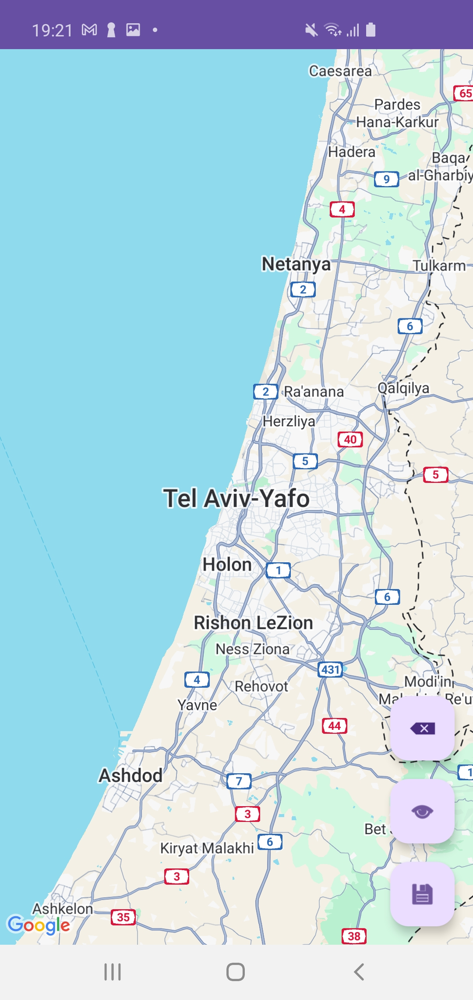
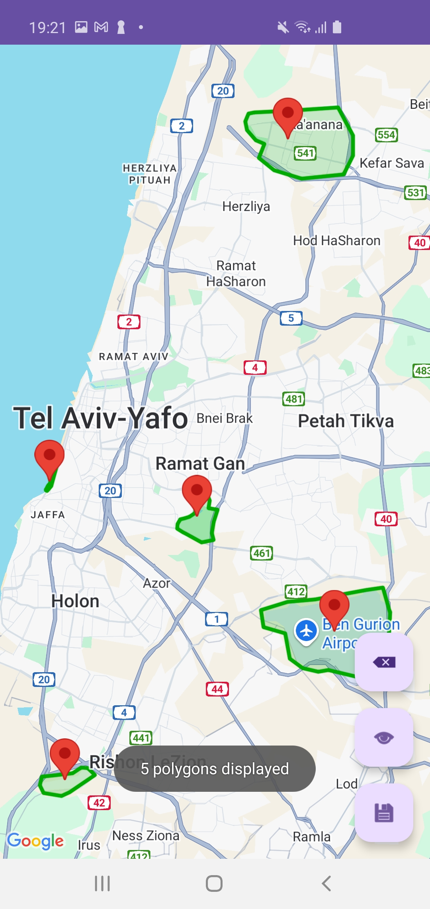
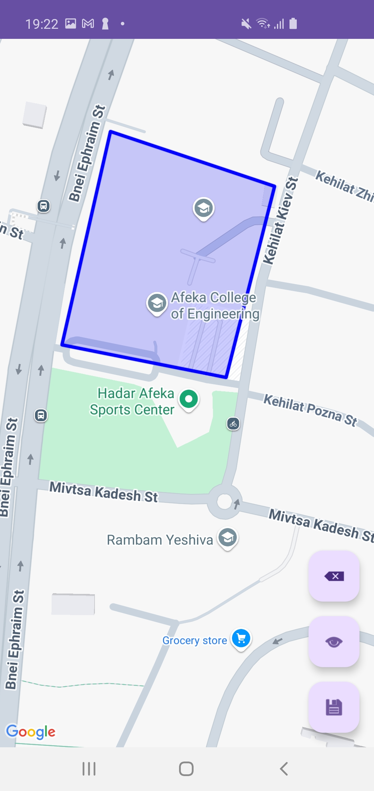
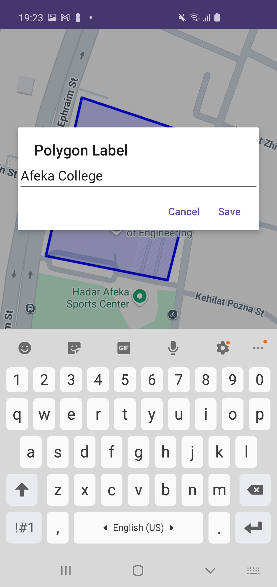
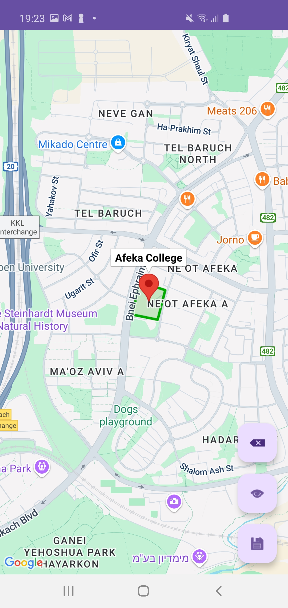
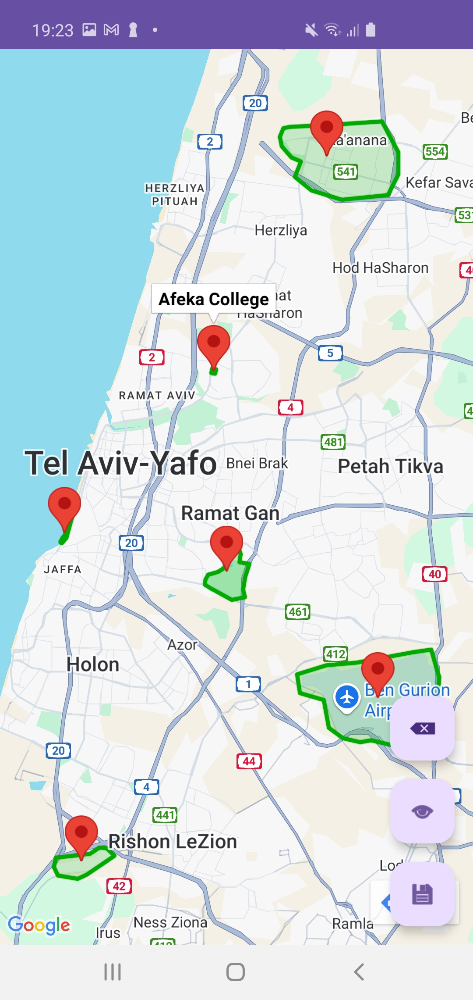

# 📍 Map Drawing SDK

This project allows Android applications to **draw**, **label**, and **save polygons** on a map, using a **Spring Boot backend** connected to **Firebase Firestore**.

---

<div style="white-space: nowrap;">
   
   
   
   
   
   
</div>

---

## 🧱 Project Architecture

### 🔍 Overview
This system is composed of three main parts:

- A **Spring Boot API service** for handling polygon data
- An **Android SDK library** that abstracts the API logic
- An **Example Android app** that demonstrates how to integrate and use the SDK

---

## 🔑 Key Components

1. **🛠 Backend API Service**
   - Built with Spring Boot
   - Stores polygon data in Firebase Firestore
   - Provides RESTful endpoints

2. **📦 Android SDK Library**
   - Easy-to-integrate SDK for drawing polygons on a map
   - Supports labeling, saving, and syncing with backend

3. **📱 Example Android Application**
   - Demonstrates real-world usage of the SDK
   - Includes map drawing interface, saving polygons, and color labeling

---

## 🌐 API Endpoints

### 📥 POST `/api/polygons`
Save a new polygon:
```json
{
  "label": "Example Polygon",
  "points": [
    { "latitude": 32.08, "longitude": 34.78 },
    { "latitude": 32.09, "longitude": 34.77 }
  ]
}
```

### 📤 GET `/api/polygons`
Retrieve all saved polygons:
```json
[
  {
    "id": "abc123",
    "label": "Polygon A",
    "points": [...]
  }
]
```

---

## 🚀 Deployment (Koyeb)

You can deploy the Spring Boot API using [Koyeb](https://www.koyeb.com/):

- ✅ Connect GitHub and point to `/api-server` directory
- ✅ Set environment variables:
  - `FIREBASE_CONFIG_JSON` — your Firebase service credentials
  - `FIRESTORE_TRANSPORT=rest`
- ✅ Use the provided Dockerfile for containerized deployment

The app will be publicly available at:

```
https://<your-app>.koyeb.app/api/polygons
```

---

## ✨ Features

- ✅ Draw polygons on a map using Google Maps SDK
- ✅ Add custom labels to polygons
- ✅ Save and fetch polygons from a remote backend
- ✅ Fully documented Android SDK
- ✅ Production-ready Spring Boot backend with Firebase

---

## 📦 Installation

### 1. Clone the repo
```bash
git clone https://github.com/your-username/MapDrawingSDK.git
```

### 2. Android Setup
- Open in Android Studio
- Place your `google-services.json` in `app/`
- Run the app or use the SDK in your own project

### 3. Backend Setup
- Go to the `api-server/` folder
- Add your `firebase-key.json`
- Build and run the Spring Boot app

---

## 📚 Documentation

For detailed documentation, setup instructions, and usage examples, visit:

👉 [**Documentation Site**](https://hadarzimberg.github.io/25B-10221-Advanced_Seminar_in_Mobile_Development/)

---

## ⚖ License

This project is licensed under the MIT License. See the `LICENSE` file for details.
